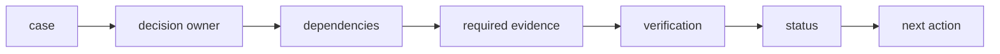

# Architecture

## Case object
Stores owner, required evidence, evidence records, blockers, completion state, and audit.

## Dependency layer
Named blockers keep a case from becoming ready.

## Evidence layer
Required items must exist and be verified.

## State machine
Owner, blockers, evidence, and completion produce a transparent status.

## Next-action function
Returns the first actionable administrative dependency.

## Design principle
A process should be explainably blocked for a concrete reason—missing owner, dependency, or evidence—not merely marked 'pending'.
